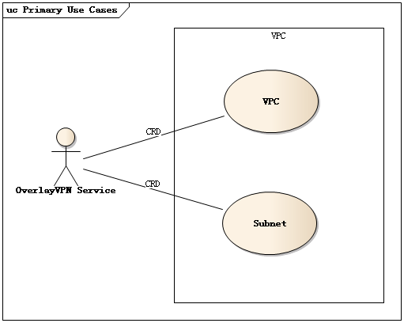
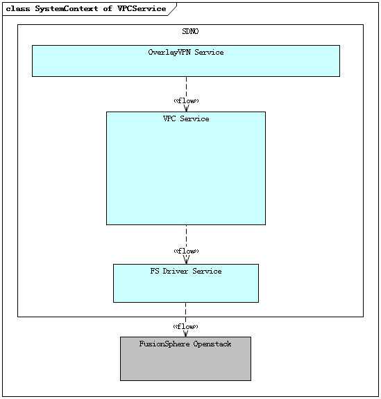
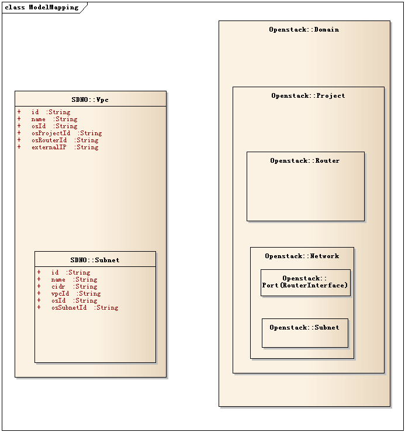
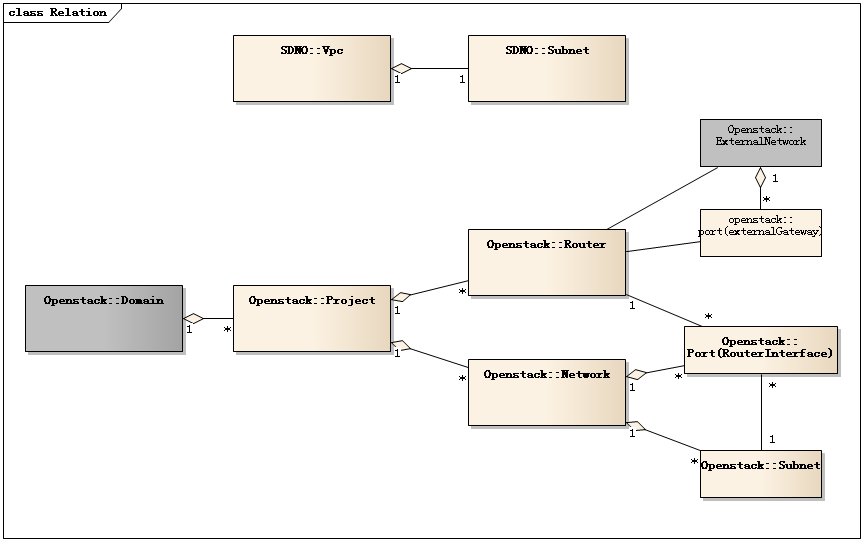
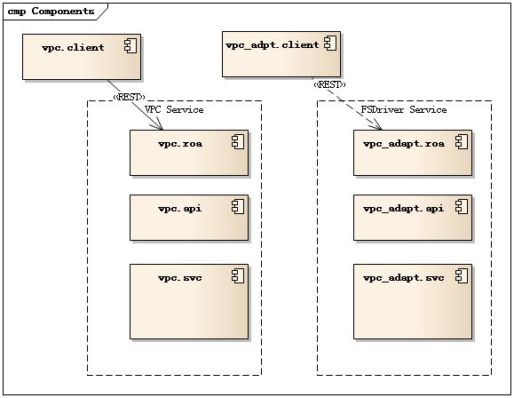

SDNO VPC Service Design
=======================

For OPENO v0.5.0

Initial Date: 2016/5/30

Last update: 2016/6/15

Author: cang.chen@huawei.com

Reviewer: SDN-O Team

Approver:

Terms
-----

| Abbrev | meaning                                           |
| ------ | ------------------------------------------------  |
| VPC    | virtual private cloud, FusionSphere wraps it from Openstack’s Project concept. |
| OPEN-O | OPEN-Orchestrator Project, under Linux Foundation |
| SDN-O  | Software Defined Network Orchestrator             |
| FS     | abbrev for FusionSphere Openstack                 |


Use cases of VPC Service
-----------------------



Figure1: VPC usecases

OverVPN will create/retrieve/delete VPC and subnets.

Context of VPC Service 
-----------------------



Figure2 : system context of VPC Service

OverLayVPN decomposite SiteToDC to vpc service and other services, FS
Driver Service wraps for FusionSphere Openstack’s interfaces.

Concepts
--------



Figure3 : VPC related concept in related system

So, SDNO:VPC equals Openstack project with one router connected to
external network, SDNO:Subnet equals Openstack’s subnet which are attached to the router.

In OPEN-O currently, only one subnet in VPC.



Figure4 : VPC related concept in related system

Currently one tenant has only one subnet in a VPC, so in openstack we
will have one project, one router, one network, one subnet.

Technical Solution
------------------

We decide to access Openstack interface directly, instead of access
middle proxy like FusionManger or COVPCService.

Q: how to model Openstack instance, region, availability-zone, VPC?

A: Openstack should be modeled as a controller. Region,
availability-zone doesn’t need to be modeled, VPC as a NE

Q: what is NE for openstack?

A: need to be decided. Mainline just create a dummy NE for user to
choose for openstack. We will check it later.

Q: how to express VPC in EPG model?

A: epg.type = “subnet”, epg.endpoints=\[*subnetid*\],
epg.ne=&lt;VPC or a dummy NE stands for openstack&gt;, some meta
information include underlayer resource information.

VPN service contain connection which has two or more endpointGroup.

Q: Do we need create project in Openstack

A: In Openstack domain admin can create project, but in Fusionsphere
only cloud admin can create project, so we require project to be created
in advance, like MANO.

> In FusionSphere /etc/keystone/policy.json
> ```
> "identity:create_project": [["role:admin"]],
> ```
> In Openstack /etc/keystone/policy.json
> ```
> "identity:create_project": "rule:cloud_admin or rule:admin_and_matching_project_domain_id",
> ```

Q: Why not create VPC through FusionManager rest interface?

A: I cann’t access FushionManager fully via rest unless I login into
   FusionManger webUI at the same machine. No one answered my question,
   so I have to give up.

Q: Can we reuse vimadapter from OPEN-O/NFVOFrame

A: Yes, we can. But vimadapter doesn't support vxlan , nor router or IPSec. 
   and In Open-O FusionSphere support also is removed.
   I prefer to refer to it.

Components
----------



Figure5 : VPC components

We recommend API first pattern. An API jar may make integrating happier.

Upper Applications of Vpc service also can ignore API jar, just coding
by the guide of interface document.

In future, may client, roa and api are generated by YANG files,
currently we have to write it line by line.

Northbound Interfaces
---------------------

```java
@PATH("/vpcservice/v1/vpcs")
public interface VpcService
{
	@POST
	@PATH("/")
	public Vpc createVpc(Vpc vpc) throws ServiceException;

	@GET
	@PATH("/")
	public List<Vpc> getVpcs(@QueryParam String tenantId) throws ServiceException;
	
	@GET
	@PATH("/{vpcId}")
	public Vpc getVpc(@PathParam("vpcId") String vpcId) throws ServiceException;
	

	@DEL
	@PATH("/{vpcuuid}")
	public void deleteVpc(@PathParam("vpcId") String vpcId) throws ServiceException;
	
	// PATCH doesn’t supported for nothing updatable.
}


class Vpc
{	
	// UUID generated by overlayVPN
	// @ref OverlayVpn.create
	String id;

	//friendly name specified by tenant.
	//@ref OverlayVpn.create vpn.vpc.name
	String name;
	
	@enum("Creating", "Created", "Create_Exception")
	String actionState;
	
	// Openstack instance id in inventory BRS or connectionInvt
	// @ref OverlayVpn.create vpn.vpc.id
	String osId;
	
	// vpc id in Openstack
	//@ref Openstack.project.create
	String osProjectId;
	
	// router id in Openstack
	//@ref Openstack.router.create
	String osRouterID;

	// router external IP in Openstack
	//@ref IPSec.create on vCpe will take this IP as peerIP
	//@ref Openstack.router.create
	String externalIP;
}

@PATH("/vpcservice/v1/subnets")
public interface SubnetService
{
	@POST
	@PATH("/")
	public Subnet create (Subnet subnet) throws ServiceException;

	@GET
	@PATH("/")
	public List< Subnet > query(@QueryParam String tenantId,
@QueryParam String vpcID) throws ServiceException;
	
	@GET
	@PATH("/{subnetId}")
	public Subnet get(@PathParam("subnetId ") String subnetId) throws ServiceException;
	

	@DEL
	@PATH("/{subnetId }")
	public void delete(@PathParam("subnetId ") String subnetId) throws ServiceException;
	
	// PATCH doesn’t supported for nothing updatable.
}


class Subnet {
	String id;// UUID generated by overlayVPN
	String name;//@ref OverlayVpn.create vpn.vpc.subnet[0].name
	String cidr;//@ref OverlayVpn.create vpn.vpc.subnet[0].cidr
	String tenantId;//@ref OverlayVpn.create vpn.tenantId
	String VpcId;// UUID generated by overlayVPN, @ref Vpc.id
	String actionState;
	String osId;// Openstack instance id
	String osSubnetId; //subnet id in Openstack, generated by Openstack.subnet.create
	String osNetworkId; //network id in Openstack, generated by Openstack.network.create
	String vni; //vxlan network segmentation id
}


```


Southbound Adapter Interface
----------------------------

???

Southbound Information need by openstack
----------------------------------------

```java

public class OpenstackVpc {
	String id; //generated by Openstack.project.create , @refby Vpc.externalID 
	String name; //@ref overlayvpn.dc.name
}

public class OpenstackSubnet {
	String id; //generated by Openstack.subnet.create , @refby Subnet.externalID 
	String name;	//@ref overlayvpn.dc.subnet[0].name
	String cidr;	//@ref overlayvpn.dc.subnet[0].cidr
	String gateway_ip; //@generated from cidr. First IP in cidr
	String dhcp_enable;	//==true
	String primary_dns;	//@ignore or read from config if demo required
	String secondary_dns;	//@ignore or read from config if demo required
	String availability_zone;	//@ignore ?? may need read from config file.
	String vpc_id;	//@ref Openstack.project.id
	String status; //@useless
	List<IPRange> availableIPRanges; //@generated from cidr. All IP in cidr exclude gateway
}

```


Flows
-----

##### Prerequisite:

VDC/VPC created for tenant in FusionManager or Openstack

tenant(username/password/vdcName) configured or saved in inventory.

keystoneURL

NeutronURL (we also can obtain from get-token result)

##### **PlanA(currently chosen)**:

create VPC via native openstack interfaces :

1. get X-Auth-Token from keystone with keystoneURL+tenantID+userId+password+vdcName

2. get project (with name=vpc.name)

3. get public network (how to get, by name=external\_api?)

4. create router with external\_gateway\_info=public network (we need
get public net-id first) (named external\_api in FusionSphere)

5. create network (with name=vpc.name, type=vxlan, tenantId=projectId)

6. create subnet (with cidr=vpc.subnet\[0\].cidr,networkid,
tenantId=projectId)

7. create routerinterface to attach subnet

##### PlanB:

create VPC via cloud-O service and openstack interface:

1. (cloud-o)create VPC with name and (tenant portal/vendor cloudsop user
!= tenantID IAM\~\~\~keystone ?? how to mapping account with openstack)

2. (cloud-o)create subnet with cidr and tenantID

3. (openstack)login into keystone

4. (openstack)get VPC project (by name=vpcname)

5. (openstack)find router by vpc ( one vpc only one router )

6. (openstack)find external\_api network (by network.name=external\_api)

7. (openstack)update Router external\_gateway\_info (bind to
external\_api networkid)

##### **IPSec related flows**

get Router By Openstack or VPCService? :

8. create IPSec VPNaas on openstack

  1. neutron vpn-service-create ROUTER(=vpc.osRouterId) SUBNET(=subnet.osSubnetId)

  2. vpn-ikepolicy-create

  3. vpn-ipsecpolicy-create

  4. ipsec-site-connection-create --peer-address PEER-ADDRESS(=vCpe.wanIP) --peer-id
PEER-ID --peer\_cidr PEER-CIDRS(=site.cidr) --vpnservice-id VPNSERVICE --ikepolicy-id IKEPOLICY --ipsecpolicy-id IPSECPOLICY

9. create IPSec VPNaas on vCPE

  1. PEER-ADDRESS=vpc.externalIp

  2. peer\_cidr=subnet.cidr


Reference
---------

\[1\] COVPCService Restful Interface

[*https://ares.host.huawei.com/servicefactory/themes/default/views/min/servicefactory.html?curMenuId=chaos.entry.chaos&id=2172*](https://ares.host.huawei.com/servicefactory/themes/default/views/min/servicefactory.html?curMenuId=chaos.entry.chaos&id=2172)

\[2\] FusionManager\_V100R005C10SPC700\_接口参考\_01(云数据中心)

[*http://support.huawei.com/*](http://support.huawei.com/)

\[3\]Openstack API document.

[*http://developer.openstack.org/api-ref.html*](http://developer.openstack.org/api-ref.html)

\[4\]VPCService repo

[*http://rnd-isourceb.huawei.com/OPEN-O/VPCService*](http://rnd-isourceb.huawei.com/OPEN-O/VPCService)

\[5\]FS Driver Service repo

[*http://rnd-isourceb.huawei.com/OPEN-O/FSDriver*](http://rnd-isourceb.huawei.com/OPEN-O/FSDriver)


\[6\] Mano VIM adapter

[*http://rnd-isourceb.huawei.com/OPEN-O/NFVOFrame/tree/develop/vimadapter/VimDriverService*](http://rnd-isourceb.huawei.com/OPEN-O/NFVOFrame/tree/develop/vimadapter/VimDriverService)
